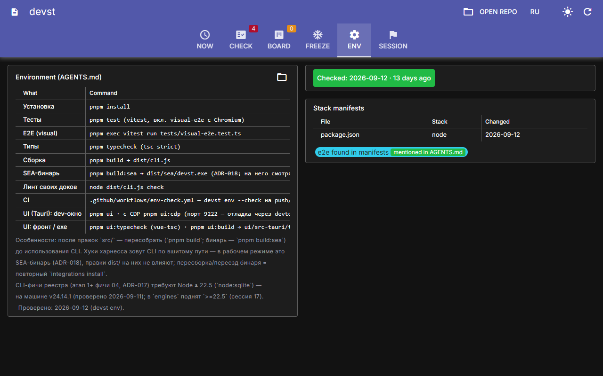
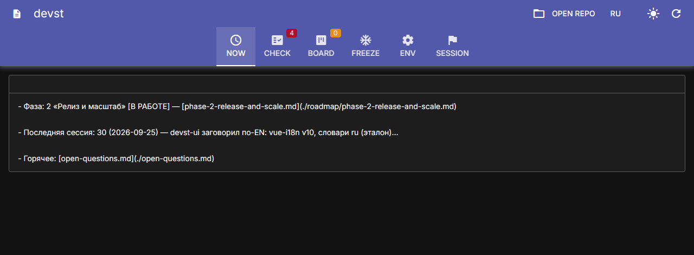
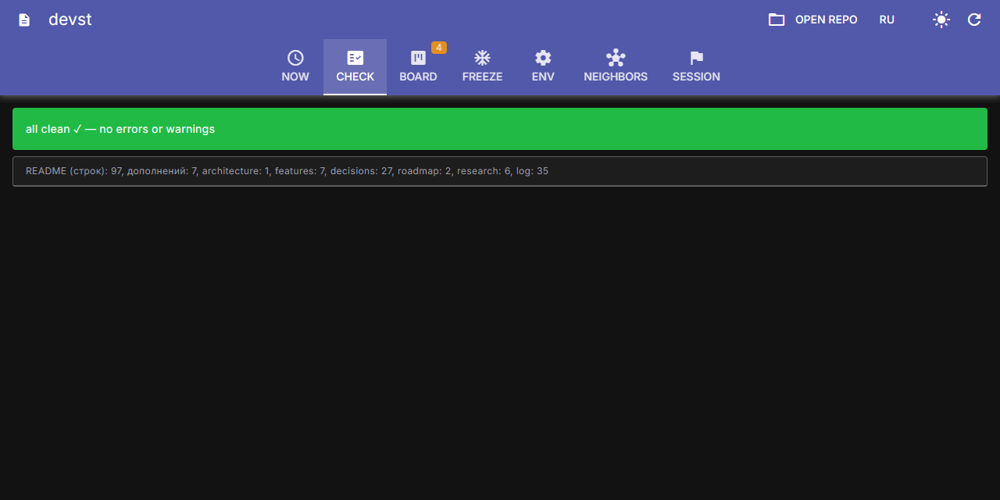
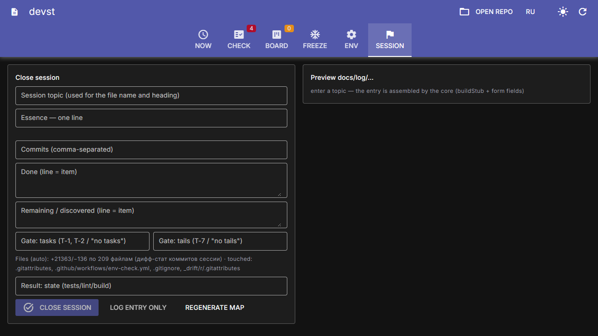
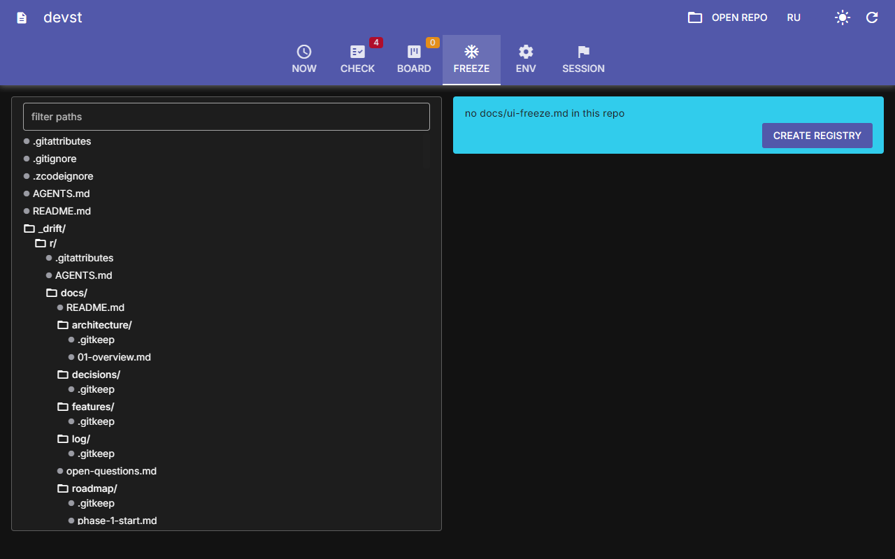
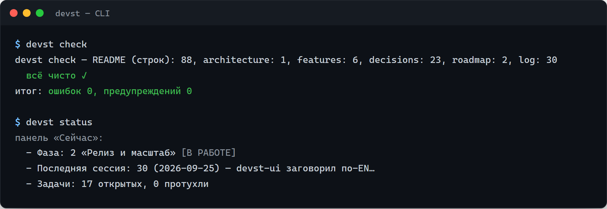

# devst

> Русский · [English](../../README.md)

**Инструментарий с документацией на первом месте для разработки с ИИ** — CLI без
единой runtime-зависимости и десктоп-компаньон на Tauri, которые держат документацию
репы живой, когда большую часть кода пишут ИИ-агенты.


[](https://github.com/someguy3021/devst-public/actions/workflows/docs-check.yml)



| Панель «Сейчас» | Чек-лист | Гейт закрытия сессии | Дерево заморозки |
|---|---|---|---|
|  |  |  |  |

*На скриншотах — десктоп-компаньон (англоязычный интерфейс, тёмная тема) в работе
с реальной репой.*

## Почему

Когда бóльшую часть диффов пишет ИИ-агент, документация в репе перестаёт быть
любезностью и становится инфраструктурой:

- **Проблема спеки.** Агент читает `AGENTS.md` и `docs/` перед каждой задачей.
  Протухшие доки молча уводят его не туда — и он уверенно им следует.
- **Проблема следа.** Агенты охотно коммитят работу, не записав её. Знание
  испаряется между сессиями; следующая сессия выводит всё заново с нуля.
- **Проблема доверия.** «Код и есть документация» ломается, когда никто — ни
  человек, ни модель — не может определить, какой из трёх противоречащих абзацев
  актуален.

devst отвечает конвенциями, обеспеченными тулзой: доки скаффолдятся, линтятся,
проверяются на свежесть и встроены в сам харнесс ИИ.

## Что внутри

| Область | Команда | Что делает |
|---|---|---|
| Линт конвенций | `devst check` | Обеспечивает документационный стандарт — шапки, карту, свежесть, перекрёстные ссылки; ненулевой код выхода для CI и pre-commit-хуков |
| Карта доков и панель «Сейчас» | `devst map` · `devst status` | Пересобирает карту документации и панель состояния за пять секунд: фаза, последняя сессия, открытая работа |
| Реестр задач | `devst task …` · `devst board` | Задачи и вопросы на SQLite со ссылками, таймерами, TTL; **закрытие проходит через гейт**, который сверяет заявленное в задаче с тем, что показывают коммиты |
| Разведка окружения | `devst env` | Сканирует манифесты стека (package.json, Cargo.toml, pyproject, Makefile, compose, CI), готовит черновик таблицы «Окружение»; CI падает, если она протухла |
| Реестр заморозки UI | `devst freeze` | Фиксирует замороженные зоны UI (включая режим **default-deny**), сверяет подготовленные диффы с реестром, охраняет правки через хуки |
| Визуальные базлайны | `devst visual` | Снапшоты раскладки + хэши экранов; опциональный честный пиксельный дифф с собственным PNG-декодером без зависимостей |
| Bug Hunt | `devst bugs emit` · `ingest` | Отдаёт внешним тестерам обфусцированный оверлей-артефакт; принимает их отчёты в точечные карточки `BUG-*`, привязанные к экранам и файлам |
| Напоминания | `devst remind` | Один конвейер напоминаний поверх провайдеров-детекторов: незадокументированные коммиты, незакоммиченная работа, протухшие задачи |
| Интеграции с харнессом | `devst integrations install` · `doctor` | Ставит скиллы, слэш-команды и хуки в харнесс ИИ из машинно-независимых канонических шаблонов; `doctor` проверяет разводку |
| Связанные репы | `devst links check` · `pin` · `mirror` | Следит за связанными devst-репами: перекрёстные ссылки `id://`, пины sha256+HEAD, тезисы логов соседа, зеркала байт-в-байт — всплывает в напоминаниях и отдельной вкладке десктопа |
| Десктоп-компаньон | `devst-ui` | Приложение Tauri v2: панель «Сейчас», чек-лист, дерево заморозки с drag-and-drop, борд задач — то же чистое ядро, исполняемое в вебвью |

## Как проходит сессия

```
Хук SessionStart ──▶ подставляет панель «Сейчас» + напоминания + статус линта
        │
        ▼
агент читает L0/L1 ──▶ AGENTS.md → карта доков → шапки доков → работа
        │
        ▼
Хук PostToolUse ──▶ линтит каждый тронутый док, охраняет замороженные UI-файлы
        │
        ▼
закрытие сессии ──▶ запись в лог (с бюджетом) → гейт задачи (заявлено vs сделано)
        │            → devst undocumented → devst check обязан быть зелёным
        ▼
CI ──▶ конвенции доков + свежесть окружения на каждый пуш
```

Философия под этим — **detect, don't block** («обнаруживай, а не блокируй»):
линтует CLI, учит скилл, обеспечивают хуки — сначала предупреждения, решает всегда
человек. Полная методология описана в [Методология dev-standard](./methodology.md).

### CLI в действии



## Архитектура одним взглядом

Чистое ядро (строки и списки, без импортов `node:*`) → тонкие обвязки (ФС, git,
SQLite, процессы) → то же ядро, исполняемое в вебвью Tauri → один самодостаточный
бинарь (Node SEA), который несёт шаблоны интеграций как встроенные ассеты и
поставляется сайдкаром десктоп-приложения.

```
┌──────────────────────────────────────────────────────────┐
│ Desktop UI (Tauri v2) — Vue 3 + Quasar in the webview    │
├──────────────────────────────────────────────────────────┤
│ Delivery — skill, slash-commands, hooks, scaffolding     │
├──────────────────────────────────────────────────────────┤
│ Shells — cli · registry-run · integrate-run · bugs-run   │
├──────────────────────────────────────────────────────────┤
│ Pure core — check · registry · freeze · env · map · …    │
└──────────────────────────────────────────────────────────┘
```

Подробности и карта модулей: [Обзор архитектуры](./architecture/overview.md).

## Документация

- [Методология dev-standard](./methodology.md) — конвенции, которые обеспечивает devst
- [Обзор архитектуры](./architecture/overview.md) — слои, хранилище, дистрибуция, тестирование
- [Фичи](./features/) — семь глубоких разборов: визуальные базлайны, Bug Hunt, десктоп-окно, реестр задач, напоминания, установщик практик, связанные репы
- [Решения (ADR)](./decisions/) — все 27 ADR (на английском)

Английская версия — источник истины: [README](../../README.md).

## Инженерные факты

- **0 runtime-зависимостей** — только stdlib Node; строгий `tsc` зелёный.
- **384 автотестов**, включая E2E на реальном Chromium для каждого экрана
  десктопа (Playwright против vite-сборки с адаптером `MockKernel`).
- **27 записанных ADR** — каждое архитектурное решение задокументировано,
  вытесненные сохранены, нумерация никогда не меняется.
- **Один самодостаточный бинарь** (Node SEA, ~88 МБ) + сайдкар десктопа: одна
  реализация правил, а не две.

## Загрузка

Собранные бинари для Windows приложены к
[GitHub Releases](https://github.com/someguy3021/devst-public/releases):

- `devst.exe` — CLI (самодостаточный, Node не требуется)
- `devst-ui.exe` — десктоп-компаньон (нужен только WebView2, предустановлен в
  Windows 10/11)

Оба не подписаны — SmartScreen покажет предупреждение при первом запуске.
Исходный код не публикуется; см. [Статус и границы](#статус-и-границы).

## Статус и границы

devst начинался как личный проект инструментария, и этот репозиторий существует,
чтобы показать его документацию, проектный след и инженерную практику. Явно о том,
что это значит:

- **Исходный код не публичен**; бинари предоставляются как есть, без гарантий.
- Проект не ищет пользователей и контрибьюторов: ишью могут остаться без ответа,
  ломающие изменения — без объявления, поддержка не обещана.
- Проект **Windows-first** (SEA-бинарь + Tauri); кроссплатформенные сборки —
  работа будущего.

## Лицензия

Документация и ассеты лицензированы под
[CC BY 4.0](../../LICENSE) — атрибуция: *someguy3021 / devst*.
